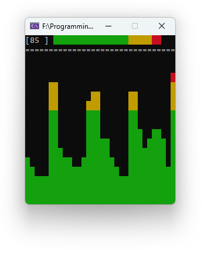

# 🎵 VU-meter
It's just a funny project that visualizes volume units (VU) in a terminal and on your keyboard LEDs for a playing music.

#### 🎚️ It demonstrates:
* EndpointVolume API through a COM interface.
* RawInput API to track a state of NumLock, CapsLock and ScrollLock buttons.
* Console manipulation to draw graphs in a console app.

#### 🎧 Usage:
Just turn on the music in your favorite player or in a browser, run the app and look at your keyboard LEDs!  
> But there is one restriction: it doesn't work with audio playing through a direct mode (usually uses in foobar2000 to listen an HD audio).  

> And yes, the second one: it looks ugly in the modern Windows Terminal app for now, so if you have a chance to run it in an old good console (or from a Visual Studio directly) - run it and enjoy.

Anyway, feel yourself like a DJ and get fun! 😄
